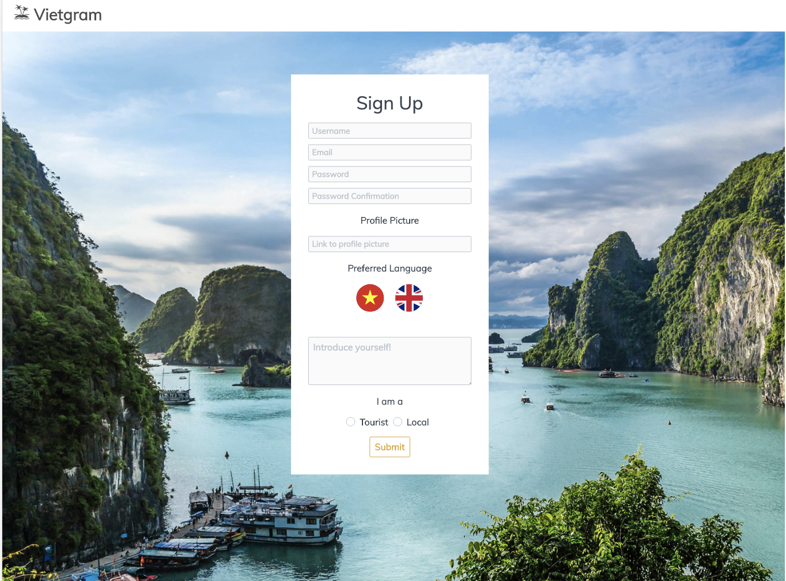
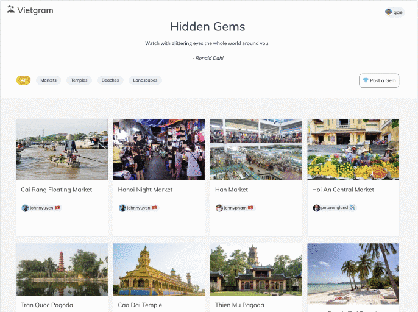
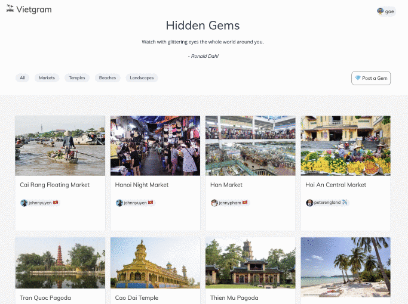
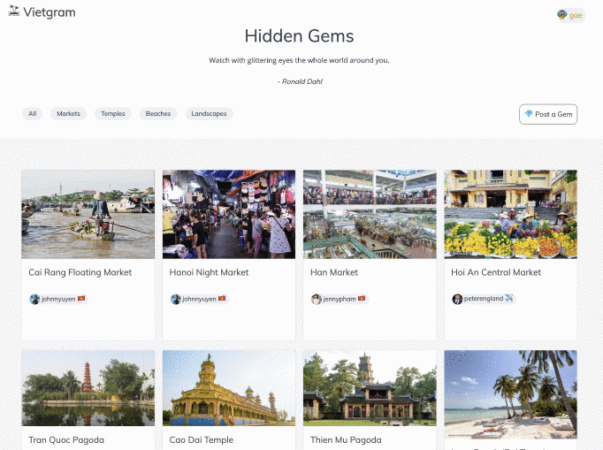
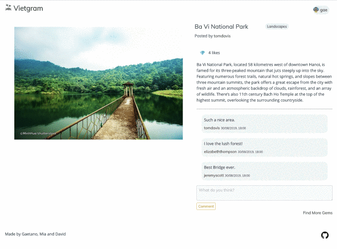

[](https://viet-gram.herokuapp.com/)

# SEI Project 3 - Vietgram
A social networking site for explorers, bringing together hidden gems reviews and comments, all in one place.

[Visit the Website](https://viet-gram.herokuapp.com/)


### Timeframe
> 7 days, group project

### Team
- Gaetano Barreca: https://github.com/gaebar
- David Tsui:  https://github.com/davt49
- Mia Meroi: https://github.com/MiaLearnsToCode

### Brief
Build a MERN (MongoDB, Express, React, Node) stack application in a group and to have automated tests for at least one RESTful resource on the back-end.

### Technologies
- HTML5 & ES6 JavaScript
- React.js, Webpack, Babel, Axios & Yarn
- CSS3, CSS Animations, Sass CSS & Spectre
- Express.js, Mongoose & MongoDB
- Insomnia, Mocha & Chai
- Yandex (translate), emoji-mart (React widget)
- Heroku

___

## Project Summary
Vietgram was the third project during the General Assembly Software Engineering Immersive course. The project was made in collaboration with David and Mia.

We had just over a week to create an app that had a custom made backend by building a RESTful API and using React to render the front end. We created Vietgram, a social networking site for explorers, bringing together hidden gems reviews and comment all in one place. We also implemented a real-time chat widget with automatic translation into the local language. 

My part in the project included building the models in Node.js, building the MongoDB database models, API endpoints and other frontend components.

___

## Process & Approach

### Task Management and Communication
The project was delivered in a group of three. We managed the project with an agile methodology with a clear timeframe for us to deliver as much of the scope as possible. To assist this process we used an Kanban Board in the form of Trello to plan and manage our task, utilizing daily stand-ups to track progress and understand blockers.

To start the project wireframes were produced to capture a high level user journey and the layout of the application prior to any development taking place. This gave us a clear understanding of how each page would interact and a basic layout that we could apply consistently across the application. David, Mia and I were happy to share the whole experience moving from back-end to front-end avoiding give a specific task for each other for the 7 days project.

### Development
Planning was an integral part the process as our focus was to produce a backend API which could coherently work in the React front-end. We first began creating wireframes to work out this structure and general content placement of the website. It was clear our application would revolve around three elements: Users, Chats and Gems. We established early that the user could choose to be a local or a traveler and also choose between two language to use: English or Vietnamese.

### Backend
The backend of the application was built using Express.js with a NoSQL MongoDB database. Models and Controllers were created for 'Gems', 'Chats' and 'User'. For both 'Gems' and 'Chats' CRUD routes were created to allow users to update 'Gems' and 'Chats' they had created. The User route included Register and Login to allow a user to create a profile to view and manage their 'Gems' or 'Chats'. User follow functionality was later added to the 'User' route.

To begin the database, we created a seeds file to add the data for all the Chats and a handful of Gems, which served two purposes: to create routes in the back-end which allowed the front-end to work with the data and as a visual tool, to help populate data when making adjustments to our API, using Insomnia as our client. 


#### Authentication
In order to carry out the authentication process, we used BCrypt to hash passwords in the backend and store it in the database so that BCrypt could compare it against the password given when logging in. We also used JSON Web Token to embed JSON into an encrypted token. This was incorporated in our login and register controller and is sent to the client when the users successfully authenticate.

### Login


### Register



### Frontend
The frontend of the application was built using React.js. The application was styled using Spectre which was customized using Scss to add a branded style across the application.

Frontend setup
* setting up components and pages
* setting up forms
* connecting API requests to the front end.

## Visuals

### Hidden Gems page

Show, like, post and delete comment.



### Gem operations page

Show, edit and delete gem.



### User profile page

View your own page and chat, with translate API and emoji widget.



### User page

View user details and follow them.



### Challenges
This was my first experience using Git workflows which provided some challenges at the beginning of the project. As a team we developed all features on individual branches before merging with the 'development' branch. Conflicts had to be closely managed to ensure the correct version of the code was pushed to the 'development' branch.

As a team we had a rigorous process which we followed as conflicts emerged. We also reduced the potential for conflicts by proactively managing task at the beginning of the day and understanding where conflicts could occur.

### Wins
A feature that was added later in the project was to allow users to follow other users. A follow route was added to the backend application which added a 'follows' array in the 'User' schema. An AJAX request is made from the frontend when a user follows another user. The current user is found in the database by the ID supplied with the AJAX request.

The user being followed is then pushed to the array of 'follows' stored in the 'User' record. The user is then saved to the database before being populated via the User schema and returned as part of the response to the frontend. This response is used to update state and display the user has now been followed.

## Key learnings
Building a functioning full-stack app where requests can successfully display information on the front end (read) and data can be created/updated/deleted on the back end.

Working with Github on a group project.

 ### Future Improvements
 - Give the change to the users to choose more then a language to chat
 - Add the use of emojis on the comments area
 - Add private messages
 - Add Nodemailer to send an email to the users email which includes a link to verify the email they have registered with. The users are notified on the front-end by a flash message. 
 
___

## Install

`yarn install`

### Initialize the MongoDB database

`yarn seed`

### Run the app

Start the MongoDB Daemon (Background Process):

`mongod`

Start the backend server

`yarn serve:back`

Start the frontend server

`yarn serve:front`

## Deployment

With heroku, automatically deploys when new code is pushed to `master`

# Interesting code snippets

## Node.js
The models and controllers are separated into 3 categories: chats, gems and users. There are many RESTful routes, since gems would require all the CRUD routes while chats and users require less. The Router class keeps all the routes of the Backend in one place and so easier to manage.

```javascript
// gems route
router.route('/gems/:gemId/likes')
  .get(secure, gems.like)

router.route('/gems/:gemId/comments/:commentId')
  .delete(secure, gems.commentDelete)

router.route('/gems/:gemId/comments')
  .post(secure, gems.commentCreate)

router.route('/gems/:gemId')
  .get(secure, gems.show)
  .put(secure, gems.edit)
  .delete(secure, gems.delete)

router.route('/gems')
  .get(secure, gems.index)
  .post(secure, gems.create)
```

The ``Error Handler`` function gives all error messages a numbered status and can be applied for all the errors across the Backend.

```javascript
function errorHandler(err, req, res, next) {
  if (err.message === 'Unauthorized') {
    return res.status(401).json({ message: 'Unauthorized' })
  }
  if (err.name === 'TokenExpiredError') {
    return res.status(401).json({ message: 'Token expired' })
  }
  if (err.name === 'NotFound') {
    return res.status(404).json({ message: 'Not Found' })
  }
  if (err.name === 'ValidationError') {

    const errors = {}
    for (const field in err.errors) {
      errors[field] = err.errors[field].message
    }
    err.errors = errors

    return res.status(422).json({ message: 'Unprocessable Entity', errors })
  }

  res.status(500).json({ message: 'Internal Server Error' })
  next(err)
}
```

``Logger`` manages the console.log that informs you of all the backend RESTful requests that are happening while using the site.


``` javascript
function logger (req, res, next) {
  console.log(`${req.method} Request to ${req.url}`)
  next()
}
```

``Secure Route`` checks that the Authorization token is present and manages the JSON Web Token through a Promise.

```javascript
function secureRoute(req, res, next) {
  if (!req.headers.authorization) return res.status(401).json({ message: 'Unauthorized' })

  const token = req.headers.authorization.replace('Bearer ', '')

  new Promise((resolve, reject) => {
    jwt.verify(token, secret, (err, payload) => {
      if (err) return reject(err)
      return resolve(payload)
    })
  })
    .then(payload => User.findById(payload.sub))
    .then(user => {
      if (!user) return res.status(401).json({ message: 'Unauthorized' })
      req.currentUser = user
      next()
    })
    .catch(err => res.status(422).json(err))
}
```

The ``Seeds`` file contains all the creative content from user profiles, gems to chats that makes up the pre-filled portion of the site.

```javascript
// require the models
const User = require('../models/user')
const Chat = require('../models/chat')
const Gem = require('../models/gem')

mongoose.connect(dbURI, { useNewUrlParser: true, useCreateIndex: true }, (err, db) => {
  if (err) console.log(err)
    db.dropDatabase()
      .then(() => {
        return User.create([
          {
            username: 'jennypham',
            email: 'jennypham@email',
            password: 'pass',
            passwordConfirmation: 'pass',
            image: 'https://upload.wikimedia.org/wikipedia/commons/d/d3/Midu_-_Summer_2012_%28Explored_1_-_May_24th%29_cropped.jpg',
            lang: 'vi',
            text: 'I know places yeah.',
            userType: 'Local'
          },
          //... adds more entities to the database
        ])
      })
})
```

## React code

Each RESTful path from the backend has its own component which manages the functions and requests on the page. Many have the handleChange and handleSubmit functions that are linked to elements going into render.

### From the ChatShow component

```javascript
  handleChange(e) {
    const name = e.target.name
    const value = e.target.value
    this.setState({ name, value })
  }

  handleSubmit(e) {
    e.preventDefault()
    const comment = { [this.state.name]: this.state.value }
    axios.post(`/api/chats/${this.props.match.params.chatId}/comments`, comment, {
      headers: { Authorization: `Bearer ${Auth.getToken()}` }
    })
      .then(() => this.getData())
      .then(() => this.setState({ name: '', value: '' }))
      .catch(err => console.log(err))
  }
```

The filter Gems option is done almost entirely on React, using the category data from seeds, the Gems are filtered to show only the categories selected.

```javascript
  filterGems() {
    const regexp = new RegExp(this.state.filterCategory, 'i')
    return this.state.data.filter(gem => regexp.test(gem.category))
  }
```

## Render example

```javascript
<div className="filter-nav">
  <label
    className={`chip ${this.state.checked === 0 ? 'bg-warning' : ''}`}
    htmlFor="tag-0">
    All
  </label>
  <label
    className={`chip ${this.state.checked === 1 ? 'bg-warning' : ''}`}
    htmlFor="tag-1">
    Markets
  </label>
  <label
    className={`chip ${this.state.checked === 2 ? 'bg-warning' : ''}`}
    htmlFor="tag-2">
    Temples
  </label>
  <label
    className={`chip ${this.state.checked === 3 ? 'bg-warning' : ''}`}
    htmlFor="tag-3">
    Beaches
  </label>
  <label
    className={`chip ${this.state.checked === 4 ? 'bg-warning' : ''}`}
    htmlFor="tag-4">
    Landscapes
  </label>
</div>
```

The ``Gem component`` gets referenced directly into Gems and acts as a huge function outside of the component, where the design and references to the seeds file is managed. A crucial part of the whole app.


```javascript
import React from 'react'
import { Link } from  'react-router-dom'

const Gem = ({ image, location, user, _id }) => {
  return (
    <div className="column col-3 col-lg-6 col-sm-12 gem-card">
      <div className="card gem-card">
        <Link to={`/gems/${_id}`} >
          <div className="card-image">
            
          </div>
          <div className="card-header">
            <div className="card-title h5">{location}</div>
          </div>
        </Link>
        <div className="card-body">
          <div className="card-subtitle text-gray">
            <div className="chip">
              <Link to={`/users/${user._id}`} aria-label="Close" role="button">
                
                {user.username}
                <span> {user.userType === 'Local' ? ' 🇻🇳 ' : ' ✈️ '} </span>
              </Link>
            </div>
          </div>
        </div>
      </div>
    </div>
  )
}

export default Gem
```

``Auth`` handles the log in and authentication for the user. Giving a token that expires after a set time when the user log in. Removes the token while logging out.

```javascript
class Auth {
  static setToken(token) {
    localStorage.setItem('token', token)
  }

  static getToken() {
    return localStorage.getItem('token')
  }

  static logout() {
    localStorage.removeItem('token')
  }

  static getPayload() {
    const token = this.getToken()
    if (!token) return false
    const parts = token.split('.')
    if (parts.length < 3) return false
    return JSON.parse(atob(parts[1]))
  }

  static isAuthenticated() {
    const payload = this.getPayload()
    const now = Math.round(Date.now() / 1000)
    return now < payload.exp
  }
}
```

``Chat Show`` handles a lot of visual presentation that requires authentication and user information, the comments are presented in the profile's selected language.

```javascript
<div className="panel-body">
  {this.state.chat.comments.map(comment => {
    return <div key={comment._id} className={`message ${Auth.getPayload().sub === comment.user._id ? 'user-message' : 'tile chat-message'}`}>
      <div className="tile-icon">
        <Link to={`/users/${comment.user._id}`}>
          <figure className="avatar"></figure>
        </Link>
      </div>
      <div className="tile-content">
        <p className="tile-title text-bold">
          {comment.user.username}
          <span> {comment.user.userType === 'Local' ? ' 🇻🇳 ' : '✈️ '} </span>
          <small> {new Date(comment.createdAt).toLocaleString().slice(0,17)} </small>
        </p>
        <div className={`${Auth.getPayload().sub === comment.user._id ? 'user-flex' : ''}`}>
          <p className={`${Auth.getPayload().sub === comment.user._id ? 'user-subtitle' : 'tile-subtitle'}`}>{comment.text}</p>
        </div>
      </div>
    </div>
  })
  }
</div>
```

``App.js`` contains the BrowserRouter which easily manages the switching of different routes.

```javascript
<BrowserRouter>
  <main>
    <Navbar />
    <Switch>
      <Route path='/chats/:chatId' component={ChatShow}/>
      <Route path='/chats' component={Chats}/>
      <Route path='/gems/new' component={GemCreate}/>
      <Route path='/gems/:gemId/edit' component={GemEdit}/>
      <Route path='/gems/:gemId' component={GemsShow}/>
      <Route path='/gems' component={Gems}/>
      <Route path='/profile' component={Profile}/>
      <Route path='/users/:userId' component={UserShow}/>
      <Route path='/register' component={Register}/>
      <Route exact path='/' component={Login} />
    </Switch>
    <Footer />
  </main>
</BrowserRouter>
```
